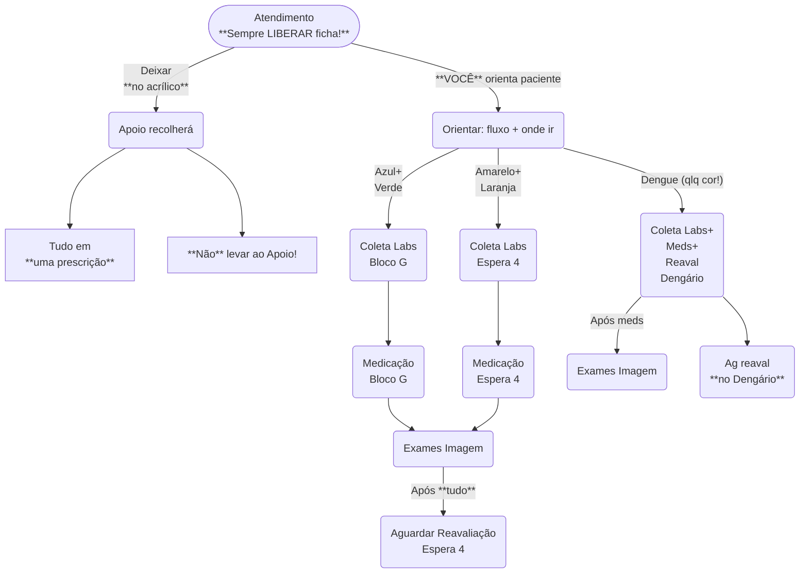
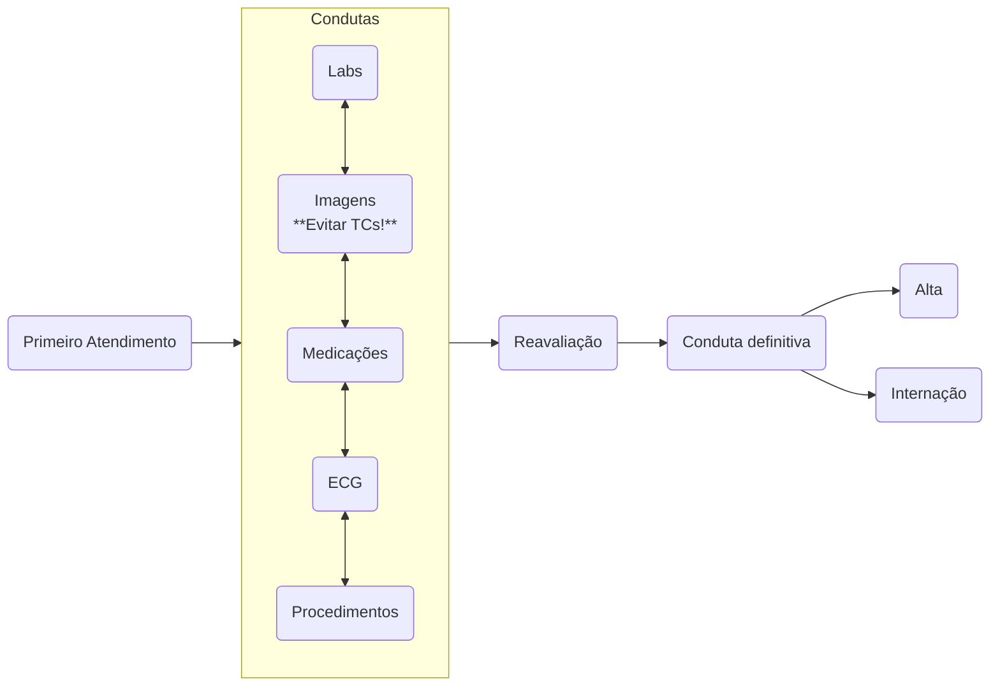

# Fluxo de Atendimento

{: .danger }
> **SEMPRE** liberar os atendimentos quando acabá-los!
>
> Em caso de dificuldades em liberar os atendimentos, procure ajuda do Apoio.

## Reavaliações

{: .warning }
> Evitar re-reavaliações!
>
> 70-80%[1][2] dos diagnósticos definitivos podem ser feitos só com uma anamnese adequada &ndash; invista tempo nisso.

[1]: Foo
[2]: Bar
