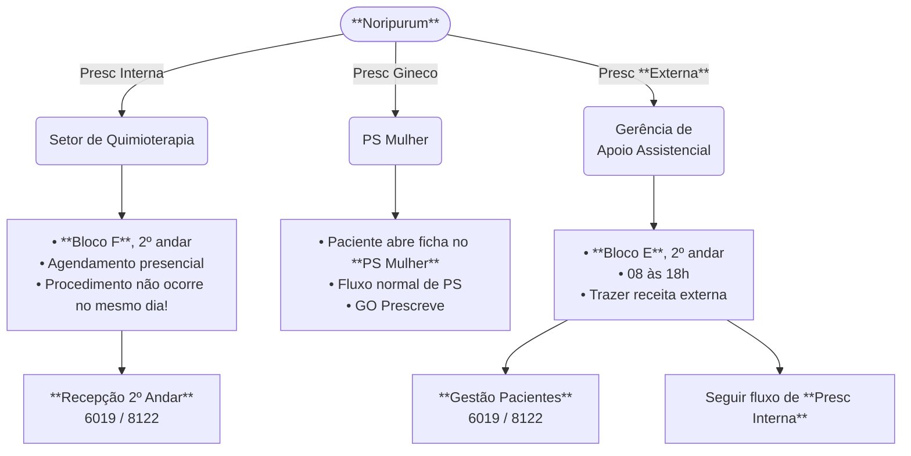

# Noripurum

```mermaid
flowchart TD
  Nori(["**Noripurum**"]) -- Presc Interna --> Interna("Setor de Quimioterapia")
  Interna --> Interna_Ori["• **Bloco F**, 2º andar<br>• Agendamento presencial<br>• Procedimento não ocorre no mesmo dia!"]
  Interna_Ori --> Interna_Ramais["**Recepção 2º Andar**<br>6019 / 8122"]
  Nori -- Presc Gineco --> GO("PS Mulher")
  GO --> GO_Ori["&bull; Paciente abre ficha no **PS Mulher**<br>&bull; Fluxo normal de PS<br>&bull; GO Prescreve"]
  Nori -- Presc **Externa** --> Externa("Gerência de<br>Apoio Assistencial")
  Externa --> Externa_Ori["&bull; **Bloco E**, 2º andar<br>&bull; 08 às 18h<br>&bull; Trazer receita externa"]
  Externa_Ori --> Externa_Ramais["**Gestão Pacientes**<br>6019 / 8122"]
  Externa_Ori --> Externa_Fluxo["Seguir fluxo de **Presc Interna**"]
```
