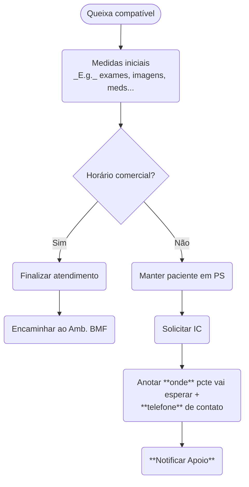

# Interconsultas

**Sempre** solicitar ICs como `Urgente`. ICs solicitadas como qualquer outro tipo serão ignoradas pelas especialidades!

## Especialidades

Apesar do Iamspe dispôr de serviços de quase todas as especialidades e subespecialidades médicas, nem todas respondem interconsultas, ou respondem 24-7...

| Especialidade | Seg-Sex | Sáb-Dom | Diurno | Noturno | Observação |
|:-------------:|:-------:|:-------:|:------:|:-------:|:-----------|
| Alergoimunologia | :check_mark_button: | :cross_mark: | :check_mark_button: | :cross_mark: | &mdash; |
| Bucomaxilofacial | :check_mark_button: | :check_mark_button: | :check_mark_button: | :check_mark_button: | Em horário comercial, dar alta e encaminhar ao **Ambulatório** da BMF, demais apenas de sobreaviso |
| Cir. Cabeça e Pescoço |||| :cross_mark: **Não solicitar ICs cirúrgicas** | Encaminhar à `CIRURGIA GERAL PS ADULTO` |
| Cir. Geral HSPE |||| :cross_mark: **Não existe IC** | &mdash; |
| Cir. Geral PS Adulto |||| :cross_mark: **Não existe IC** | **Encaminhar** à especialidade |
| Cir. Pediátrica |||| :cross_mark: **Não solicitar ICs cirúrgicas** | Encaminhar à `CIRURGIA GERAL PS ADULTO` |
| Cir. Torácica |||| :cross_mark: **Não solicitar ICs cirúrgicas** | Encaminhar à `CIRURGIA GERAL PS ADULTO` |
| Cir. Vascular |||| :cross_mark: **Não solicitar ICs cirúrgicas** | Encaminhar à `CIRURGIA GERAL PS ADULTO` |
| Clínica Médica |||| :cross_mark: **Não existe IC** | &mdash; |
| Clínica Médica - Dengue |||| :cross_mark: **Não existe IC** | **Encaminhar** à especialidade |
| Clínica Médica Emergência |||| :cross_mark: **Não existe IC** | &mdash; |
| Clínica Médica PS Geral |||| :cross_mark: **É a gente...** | &mdash; |
| Cuidados Paliativos |||| :cross_mark: **Não existe mais IC** | &mdash; |
| Dermatologia |||| :cross_mark: **Não existe IC** | &mdash; |
| Doenças do Ap. Respiratório |||| :cross_mark: **Não existe IC** | &mdash; |
| Endocrinologia | :check_mark_button: | :cross_mark: | :check_mark_button: | :cross_mark: | &mdash; |
| Gastrocirurgia |||| :cross_mark: **Não solicitar ICs cirúrgicas** | Encaminhar à `CIRURGIA GERAL PS ADULTO` |
| Gastroclínica |||| :cross_mark: **Não existe IC** | &mdash; |
| Geriatria |||| :cross_mark: **Não existe IC** | &mdash; |
| Ginecologia |||| :cross_mark: **Não existe IC** | **Encaminhar** à especialidade |
| Grupo de PICC |||| :cross_mark: **Só para pacientes internados** | &mdash; |
| Hematologia | :check_mark_button: | :cross_mark: | :check_mark_button: | :cross_mark: | &mdash; |
| Hemoterapia |||| :cross_mark: **Não existe IC** | &mdash; |
| Moléstias Infecciosas | :check_mark_button: | :cross_mark: | :check_mark_button: | :cross_mark: | &mdash; |
| Nefrologia |||| :cross_mark: **Só para pacientes internados** | &mdash; |
| Neurocirurgia | :check_mark_button: | :check_mark_button: | :check_mark_button: | :check_mark_button: | **Sempre** pedir TC apropriada com IC |
| Neuroclínica | :check_mark_button: | :cross_mark: | :check_mark_button: | :cross_mark: | Até as 13h apenas |
| Obstetrícia |||| :cross_mark: **Não existe IC** | **Encaminhar** à especialidade |
| Oncologia | :check_mark_button: | :cross_mark: | :check_mark_button: | :cross_mark: | Sem biópsia/anatopatológico, eles não vão fazer nada |
| Ortopedia PS Adulto |||| :cross_mark: **Não existe IC** | **Encaminhar** à especialidade |
| Otorrinolaringologia |||| :cross_mark: **Não existe IC** | **Encaminhar** à especialidade |
| Pediatria |||| :cross_mark: **Não existe IC** | Não deveria ser necessário atender pacientes <18a na Clínica... |
| Psiquiatria | :check_mark_button: | :cross_mark: | :check_mark_button: | :cross_mark: | **Sempre pedir labs gerais** (v. abaixo) junto com IC |
| Queimados |||| :cross_mark: **Não solicitar ICs cirúrgicas** | Encaminhar à `CIRURGIA GERAL PS ADULTO` |
| Reumatologia | :check_mark_button: | :cross_mark: | :check_mark_button: | :cross_mark: | &mdash; |
| Urologia |||| :cross_mark: **Não solicitar ICs cirúrgicas** | Encaminhar à `CIRURGIA GERAL PS ADULTO` |
| Vascular Intervencionista |||| :cross_mark: **Não solicitar ICs cirúrgicas** | Encaminhar à `CIRURGIA GERAL PS ADULTO` |

## IC Psiquiatria

Sempre solicitar, no mesmo tempo de solicitação da interconsulta em si:

- Ureia/Creatinina;
- Sódio/Potássio;
- Hemograma completo;
- TGO/TGP.

A Psiquiatria não irá avaliar paciente sem tais exames solicitados, não importa quão inequívoca e irrevogavelmente não seja possível atribuir sintomas a causas orgânicas...

Se, no entanto, quadro do paciente fôr mais compatível com etiologia orgânica, talvez seja mais prudente investigar o que nos cabe **antes** de solicitar IC Psiquiatria.

## IC Bucomaxilofacial

