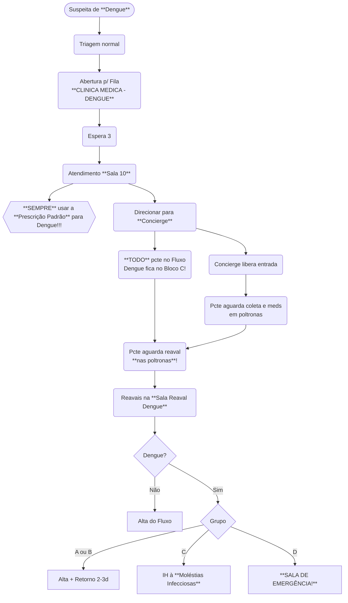

# Dengue

## Prescrição Padrão

**SEMPRE** usar a prescrição-padrão de dengue, na suspeita ou em casos já confirmados!

## Interconsultas MI

Considerar interconsultas da *Moléstias Infecciosas* nos seguintes casos:

- Suspeita de coinfecção outra além de Dengue;
  - Em especial suspeita de Hepatite Aguda e/ou Febre Amarela!
- Seguimento prévio com MI.

A **internação** de casos de Dengue **não precisa de autorização prévia da *MI*!**

## Retornos

Para retorno, orientar paciente procurar **Guichê 1** da Recepção com documentos de retorno preenchidos, assinados e carimbados!

